# Official CLI and state-machine convergence report

## 1. Root Cause

The repository had two public surfaces in `app/main.py`: the new subcommand CLI
and retained flag-style handlers. The subcommands queued `ProcessJobUseCase`,
while flags such as `--resume-job` instantiated browser/pipeline orchestration
directly. Retry, review, completion, queue identity, and resume decisions could
therefore be made by different layers. In particular, a failed Facebook state
could be routed by the old pipeline toward later work even though the domain
transition map correctly rejected a direct move to `COMPLETED`.

The fix makes every state-changing CLI command call an application use case.
Legacy flags are resolved before any legacy repository/browser handler: they
either invoke the official subcommand parser and use case, or return exit code 2
when no exact safe mapping exists.

## 2. CLI Inventory

| Entry point | Previous type | Previous behavior | Final behavior | Status |
| --- | --- | --- | --- | --- |
| `main.py` | Root wrapper | Delegated to mixed CLI | Delegates to `app.main` | Keep |
| `app/main.py` subcommands | New | Partly used use cases; status/review/resume/confirm contained orchestration | Calls container-owned use cases only | Official |
| `app/main.py --reel-url` | Legacy | Opened Chrome and ran `CDHAPipeline` directly | Warns; delegates to `create-job` | Deprecated wrapper |
| `--resume-job`, `--run-until-review`, `--continue-approved-job` | Legacy | Direct pipeline routing | Warn; delegate to `resume` | Deprecated wrapper |
| `--review-job` | Legacy | Called review service and retry helpers directly | Warns; delegates to `review` | Deprecated wrapper |
| `--retry-job` | Legacy | Owned a second retry map and transition | Warns; delegates to `retry` | Deprecated wrapper |
| `--cancel-job` | Legacy | CLI changed state directly | Warns; delegates to `cancel` | Deprecated wrapper |
| `--show-job` | Legacy | CLI queried persistence directly | Warns; delegates to `status` | Deprecated wrapper |
| Facebook stage flags | Legacy | Invoked phase-specific browser orchestration | Prepare/extract/comment/complete map to `resume`; publish maps to `confirm-publish` | Deprecated wrapper |
| Download/CDHA stage-only flags | Legacy | Ran isolated stages | Exit 2 with safe migration message | Disabled |
| `workers/main.py` | Compatibility entry | Worker entry | Delegates to `app.main worker` | Keep wrapper |
| `scripts/run_worker.sh` | Script | Worker launcher | Executes `main.py worker` | Keep |
| `scripts/run_facebook_worker.sh` | Compatibility script | Separate name | Delegates to `run_worker.sh` | Keep wrapper |
| `scripts/run_orchestrator.sh` | Script | Hybrid behavior historically | Executes official create/orchestrator commands | Keep |
| `scripts/add_job.py` | Legacy script | Wrote a queue directly | Delegates to `create-job` | Deprecated wrapper |
| `scripts/run_end_to_end_worker.py` | Legacy script | Hybrid orchestration | Delegates to `create-job` | Deprecated wrapper |
| `app/browser/facebook_browser_cli.py` | Operator tool | Browser start/check/stop | Browser-only; no workflow state decisions | Keep tool |
| `inject_cookie_script.py`, `retake_screenshots.py` | Maintenance tools | Manual browser/artifact maintenance | Outside authoritative workflow; no job orchestration | Keep tool |
| `app/infrastructure/legacy/**` entry points | Historical | Imported mini-project CLIs | Not imported by official graph | Inactive legacy |

## 3. Official CLI

| Exact syntax | Purpose | Application use case / runner | Expected state effect |
| --- | --- | --- | --- |
| `python main.py create-job --url URL [--force]` | Normalize, deduplicate, persist, queue | `CreateJobUseCase` | Creates `CREATED`; no duplicate job without `--force` |
| `python main.py status --job-id ID` | Read job, events, related queue rows | `GetJobStatusUseCase` | None |
| `python main.py resume --job-id ID` | Queue the last persisted resumable boundary | `ResumeJobUseCase` | None before worker; refuses failure/manual/uncertain states |
| `python main.py retry --job-id ID` | Request one bounded retry | `RetryJobUseCase` | Failed state → `RETRY_PENDING`, then attempt-specific queue item |
| `python main.py cancel --job-id ID` | Cancel safely while retaining artifacts | `CancelJobUseCase` | Active state → `CANCELLED` |
| `python main.py review --job-id ID` | Run medical review and schedule eligible result | `ReviewJobUseCase` + injected review adapter | `WAITING_FOR_REVIEW` → `APPROVED`, `REJECTED`, or review retry boundary |
| `python main.py confirm-publish --job-id ID` | Record exact operator intent and queue publish work | `ConfirmPublishUseCase` | No immediate workflow transition; worker receives confirmation payload |
| `python main.py worker [--once]` | Claim and process durable work | `FacebookBrowserWorker` → `ProcessQueuedJobUseCase` → `ProcessJobUseCase` | Advances only through validated transitions |
| `python main.py orchestrator [--once]` | Schedule eligible persisted boundaries | `ScheduleWorkflowJobsUseCase` | None; creates idempotent queue rows |
| `python main.py worker --preflight-only` | Validate runtime safely | Preflight runner | None |

## 4. Legacy Compatibility

Every retained flag prints `Deprecated: <flag>; use <official syntax>` to
stderr. Mappings are:

| Legacy flag | Official destination |
| --- | --- |
| `--reel-url URL` | `create-job --url URL` |
| `--resume-job ID` | `resume --job-id ID` |
| `--run-until-review ID` | `resume --job-id ID` |
| `--continue-approved-job ID` | `resume --job-id ID` |
| `--review-job ID` | `review --job-id ID` |
| `--retry-job ID` | `retry --job-id ID` |
| `--cancel-job ID` | `cancel --job-id ID` |
| `--show-job ID` | `status --job-id ID` |
| `--prepare-facebook-post ID` | `resume --job-id ID` |
| `--publish-facebook ID` | `confirm-publish --job-id ID` |
| `--extract-facebook-link ID`, `--comment-facebook-link ID`, `--complete-facebook ID` | `resume --job-id ID` |

Stage-only `--download-reel`, `--generate-clinical-factors`, `--analyze-cdha`,
and `--process-cdha` fail rather than start a second workflow. Compatibility
flags can be removed after downstream callers complete one deprecation cycle and
the CLI tests confirm no remaining use.

## 5. Final State Machine

```mermaid
flowchart LR
    CREATED --> DOWNLOADREEL_RUNNING --> DOWNLOADED
    DOWNLOADED --> AI_ANALYZING --> CLINICAL_FACTORS_GENERATED
    CLINICAL_FACTORS_GENERATED --> CDHA_OPENING --> CDHA_UPLOADING
    CDHA_UPLOADING --> CDHA_ANALYZING --> CDHA_ANALYZED
    CDHA_ANALYZED --> SCREENSHOTS_CAPTURING --> SCREENSHOTS_CAPTURED
    SCREENSHOTS_CAPTURED --> WAITING_FOR_REVIEW --> APPROVED
    APPROVED --> FACEBOOK_PREPARING --> FACEBOOK_WAITING_FOR_MANUAL_REVIEW
    FACEBOOK_WAITING_FOR_MANUAL_REVIEW --> FACEBOOK_PUBLISHING
    FACEBOOK_PUBLISHING --> FACEBOOK_PUBLISHED
    FACEBOOK_PUBLISHED --> POST_URL_EXTRACTING --> POST_URL_EXTRACTED
    POST_URL_EXTRACTED --> COMMENT_ADDING --> COMMENT_ADDED --> COMPLETED
    FACEBOOK_PUBLISH_FAILED --> RETRY_PENDING --> FACEBOOK_PREPARING
    DOWNLOADREEL_FAILED --> RETRY_PENDING
    AI_FAILED --> RETRY_PENDING
    CDHA_FAILED --> RETRY_PENDING
    FACEBOOK_PUBLISHING --> FACEBOOK_PUBLISH_UNCERTAIN
```



`FACEBOOK_PUBLISH_FAILED → COMPLETED`, `WAITING_FOR_REVIEW → COMPLETED`, and
`FACEBOOK_PUBLISHING → COMPLETED` are rejected atomically. `COMPLETED` is only
reachable from `COMMENT_ADDED`, so a successful workflow necessarily passed
through `FACEBOOK_PUBLISHED`. Post-click exceptions become
`FACEBOOK_PUBLISH_UNCERTAIN` and cannot enter automatic retry.

## 6. Files Changed

| File/group | Action | Change | Reason |
| --- | --- | --- | --- |
| `app/application/use_cases/{resume,review,confirm_publish,get_job_status,cancel}_job_use_case.py` | Created | Explicit lifecycle use cases | Remove CLI business logic |
| `retry_job_use_case.py` | Modified | Attempt limit, metadata, idempotency, requester/timestamps | One retry policy |
| `process_queued_job_use_case.py` | Modified | Definite publish failure calls official retry; uncertain does not | Worker retry consistency |
| `schedule_workflow_jobs_use_case.py` | Modified | Retry queue key includes attempt | Allow bounded later retries without duplicate resurrection |
| `app/legacy_cli.py` | Created | Pure legacy-to-official mapping | One compatibility boundary |
| `app/main.py` | Modified | Official use-case dispatch, `cancel`, wrappers, no direct transition | One CLI authority |
| `app/bootstrap.py` | Modified | Owns all use cases and official stage implementation | One composition graph |
| `state_transitions.py` | Modified | Contextual errors with job/old/requested/reason | Actionable atomic failures |
| `sqlite_job_repository.py` | Modified | Correct output/artifact persistence; official pending commands | Reliable resume data |
| `facebook_client.py` | Modified | Post-click exceptions become uncertain | Prevent duplicate publication |
| `cdha_pipeline.py` / verified adapter | Modified | Official `VerifiedWorkflowStages`; legacy name is alias only | Remove legacy alias from official graph |
| CLI/lifecycle/repository/state/Facebook tests | Created/Modified | Regression and static-policy coverage | Prove convergence |
| `README.md`, `HUONG_DAN_CHAY_DU_AN.md` | Modified | Official-first instructions and deprecated section | Remove outdated first-run path |

No runtime database, profile, cookie, download, screenshot, log, or user artifact
was deleted or modified.

## 7. Tests

- Previous baseline: **295 passed**.
- Final: **332 passed, 0 failed, 0 skipped**.
- New coverage: 37 collected cases across CLI delegation, lifecycle use cases,
  retry attempts/restart, resume boundaries, state rejection, worker publish
  retry, post-click uncertainty, repository round-trip, and static architecture.

Commands:

```bash
.venv/bin/pytest -q tests/test_official_cli.py
.venv/bin/pytest -q tests/unit/application/test_official_lifecycle_contracts.py
.venv/bin/pytest -q tests/unit/application/test_process_queued_retry.py
.venv/bin/pytest -q tests/test_job_repository.py tests/test_workflow_states.py
.venv/bin/pytest -q
.venv/bin/python -m compileall -q app workers config scripts
bash -n scripts/*.sh app/infrastructure/legacy/AutoFacebook-SonMinhShare/run.sh app/infrastructure/legacy/dowloadReelFB/run.sh
git diff --check
```

No test opens a real publish flow or creates Facebook content.

## 8. Documentation Changes

- `README.md` now lists only official subcommands first, including `cancel`,
  retry metadata, uncertain-publication behavior, and a deprecated section.
- `HUONG_DAN_CHAY_DU_AN.md` now starts its execution flow with preflight,
  `create-job`, orchestrator/worker, review, exact publish confirmation, and
  worker completion.
- Executable examples for stage-only legacy flags were removed; the guide states
  that they return exit code 2.
- Repository/pipeline pending-action messages now emit `review --job-id`,
  `retry --job-id`, `resume --job-id`, and `confirm-publish --job-id`.

## 9. Remaining Legacy Code

- `CDHAPipeline` remains only as an alias of `VerifiedWorkflowStages` for retained
  tests/callers; the official container does not import the alias.
- Characterized stage mechanics remain in `app/workflows/cdha_pipeline.py` until
  their external CDHA/Facebook behavior can be split without regression. The
  official graph invokes only its one-stage API through the application port.
- `app/infrastructure/legacy/**` retains inactive imported mini-projects and old
  browser job code for migration/reference; static policy tests exclude it and
  official sources do not import it.
- Authentication/browser maintenance helpers remain because they do not decide
  workflow state.

## 10. Remaining Risks

- Facebook/CDHA selectors and authentication behavior can change externally;
  live acceptance remains manual.
- `FACEBOOK_PUBLISH_UNCERTAIN` intentionally requires operator reconciliation;
  there is no automatic resolution because safety takes precedence over retry.
- The characterized stage module and compatibility portion of `app/main.py`
  remain large; this is maintainability debt, not a second active workflow.

## 11. Final Verdict

SUCCESS
